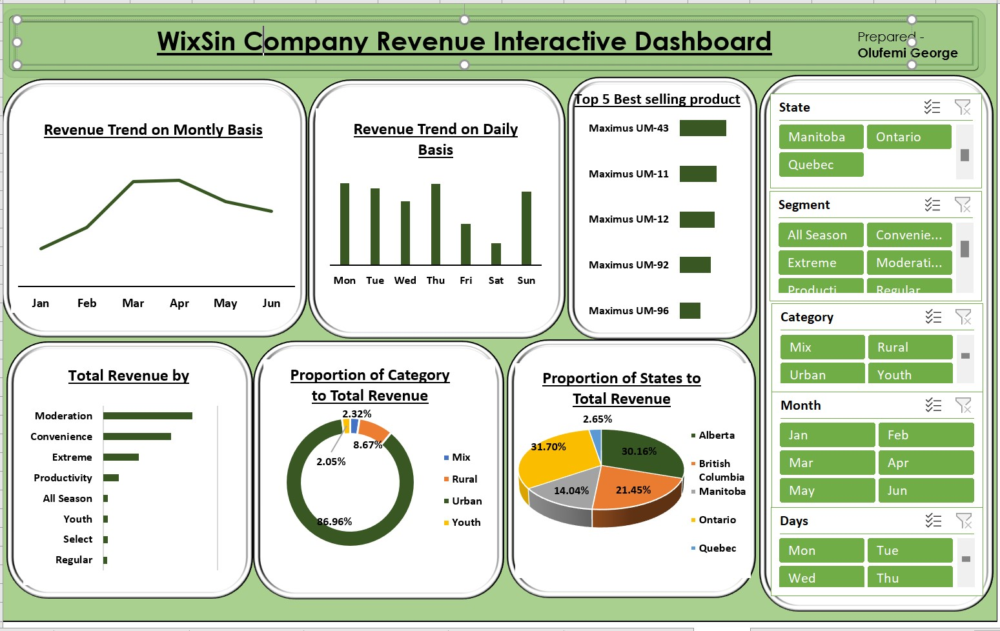
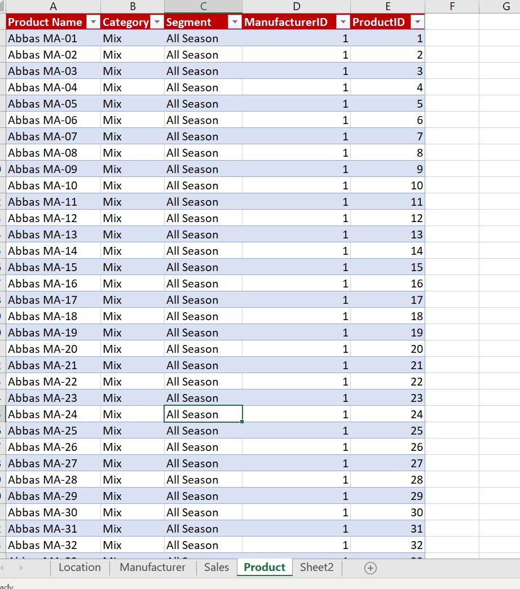
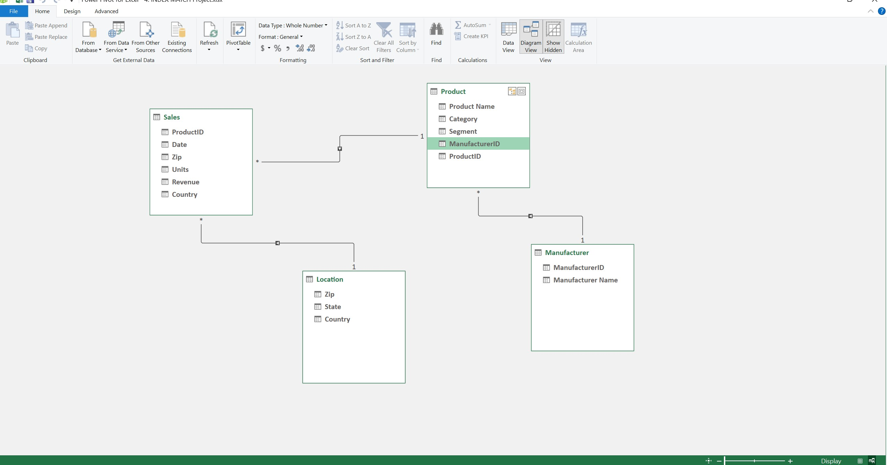
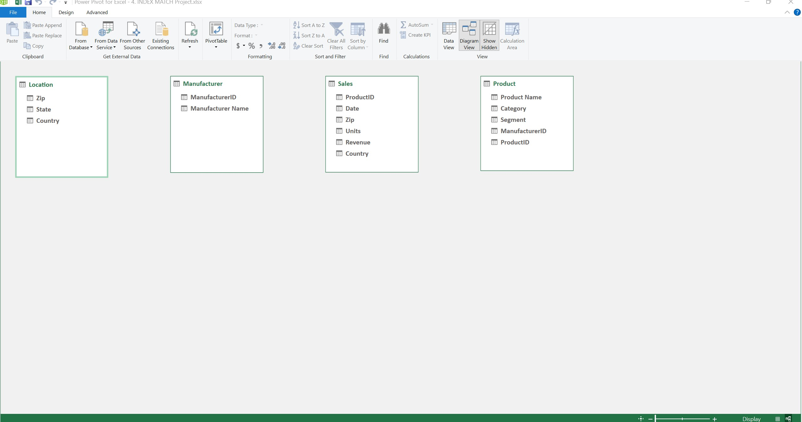
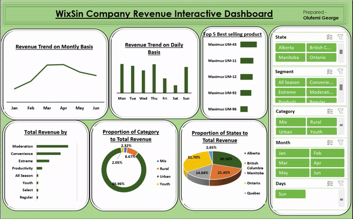

# Wixsin Company Revenue Analysis

## Introduction
The goal of this project is to analyze sales data in order to find trends, patterns, and KPIs that can be used to inform business decisions. An interactive Excel dashboard presents and visualizes the analysis results for simple exploration and comprehension.

**_Disclaimer_**: _All datasets and reports are fictitious and are intended only to show off Microsoft Excel's capabilities. They do not represent any organization, nation, or enterprise._

## Problem Statement
1. Is revenue growing on a monthly basis?
2. What days of the week does the company make the most revenue?
3. What is the proportion of category to total revenue?
4. What is the contribution of each state to the total revenue of the company?
5. What segment has the highest amount of revenue?
6. What are the top 5 selling products?

## Skills Demonstrated
The Following Microsoft Excel features were incorporated:
- Data Cleaning
- Data Consolidation with Index match
- Data Modelling with Power Pivot
- Pivot
- Visualisation chats
- Slicer

## Data Sourcing 
This revenue dataset was generated online and saved as a CSV file. The four sheets that make up the dataset are titled Location, Manufacturer, Sales, and Products. contains details on sales transactions, including dates, goods, amounts, costs, and client information. To do insightful analysis, one must be aware of the dataset's structure.

## Data Transaformation 
After loading the dataset into Ms. Excel, the dataset was inspected. In order to utilize Pivot, the Excel spreadsheet's four separate spreadsheets or tables have to be combined into a single table using Index Match. A table named sales_table was created from the spreadsheet's structure. Certain columns, like Month and Week, which I developed but extracted from the Date column, were not included in the spreadsheet. 
The dataset comprises 1412 rows and 14 columns, with a total revenue of $9,826,183 and 1430 total units.

Nevertheless, adopting Power Pivot—which eliminates the requirement for data consolidation—was also significantly faster. I was able to jump right into pivot and analysis using Power Pivot and data modeling. 

   Original Data                                 |    Consolidated Data 
:----------------------------------------------:|:---------------------------------------------:
                            |

## Data Modellining
No relationship was derive automatically so i had to create relationship Automatically 

 Adjusted model                                 |    Auto-model 
:----------------------------------------------:|:---------------------------------------------:
                                           |

The model is a star schema.
There are 4 dimension tables.

## Visualzation
The report comprises of one page

### WixSin Company Revenue Interactive Dashboard

_You can interact with the report [here](WixSin.xlsx)

Features

In order to make the visualization dynamic and allow users to filter and drill down to certain State, Segment, Category, Month and Days of the Week filter have been added to the report's right side.

## Analysis
-	This evaluation includes sales data from 2020 to 2021.
-	During the review period, Adidas US operated in 52 US cities, 50 states, and 5 regions.
-	Adidas US has six retailers.
-	There are 6 products

## The Report

Findings
-   The revenue trend indicates a consistent increase in revenue from January to April, reaching a maximum of $2,233,854 May and June trends also indicate a decline.
-   The company's daily revenue pattern shows that sales are highest on Mondays and lowest on Saturdays.
-   The percentage of each category to total revenue also shows that, at 86.96%, urban contribute the most to revenue overall, while youth contribute the least, at 2.05%.
-   According to the states' share of total revenue, Ontario contributes 31.7%, the greatest, while Quebec contributes the least, 2.65%.
-   Total Revenue by Segment reveals that, with a total contribution of $3,883,552.48, Moderation is the segment with the largest contribution, while Regular has the lowest, at $161,355.60.
-   Maximu UM-43 is the best-selling product, totaling $574,086.24.   

Suggestions / Recommendations 
-   The company revenue were performing better in:  catergory like urban, state like Ontario and Alberta, Segment like Moderation. Company should observe close the business modules in this best performing area and duplicate in other area that need improvement.
-   In states, Categories, Segment and areas that are underperforming, more sales strategies must to be put into place  

The following sales strategies below should be considered:
-   The company can continue to offer new products or services that cater to their target market and target low-income states and sectors (young, rural, and mixed).
-   Company can also give discount on some of their products or services.
-   The company can design a survey that consumers can complete online or in-store, and in certain cases, it won't take longer than five minutes.
-   Company can also provide promotions such as buy one, get one half price.
-   By examining the month that performs well in terms of weather, seasons, and retail locations, they may also examine and analyze the regions and categories that are performing well. 

